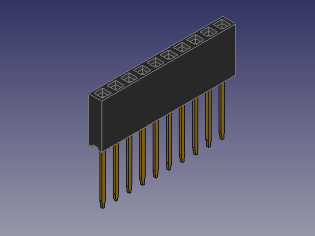

This repository contains a fully-parametric FreeCAD model for 2.54 mm (0.1 in) pitch stackable pin headers, as commonly used with Arduino Shield boards, Teensy, Raspberry Pi Pico, Feather, etc.

The parametric model can be used to generate 3D models of headers of various pin counts for use with PCB EDA/CAD software.

Ready-to-use pre-exported models in STEP format for a variety of pin counts can be found in the GitHub repository Releases.

The parameters of the model can be altered by editing values in the Spreadsheet contained within the FreeCAD tree. The primary parameter that you will probably want to alter will be the *Number of Pins* parameter.

Other modifiable parameters are:

* Pin Pitch
* Housing Height
* Housing Depth
* Hole Size
* Pin Width
* Pin Thickness
* Pin Length

All dimensional parameters are specified in millimetres (mm). Also note that some values of certain parameters may not result in a sensible model! For instance, the model has not been tested with a pin itch of anything other than 2.54 mm. Other parameters in the sheet are simply for calculation of other dimensions based on the figures above and should not be modified.

# How to Export in STEP Format

1. Open the Spreadsheet from the FreeCAD model tree. Modify the *Number of Pins* parameter value appropriately for your needs.
2. Select the top-level *Part* entry in the tree (otherwise, FreeCAD will complain that you need to "Select the objects to export before choosing Export").
3. Select the *Export* command from the *File* menu.
4. Choose *STEP with colors* file type, enter a filename, and click *Save*.
5. Alter the STEP export settings if necessary, then click *OK*.

# Licence

This work is licenced under the Creative Commons Attribution-ShareAlike 4.0 International (CC BY-SA 4.0) licence. See https://creativecommons.org/licenses/by-sa/4.0/ for details.